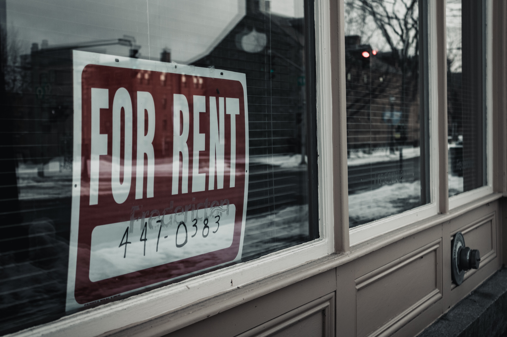
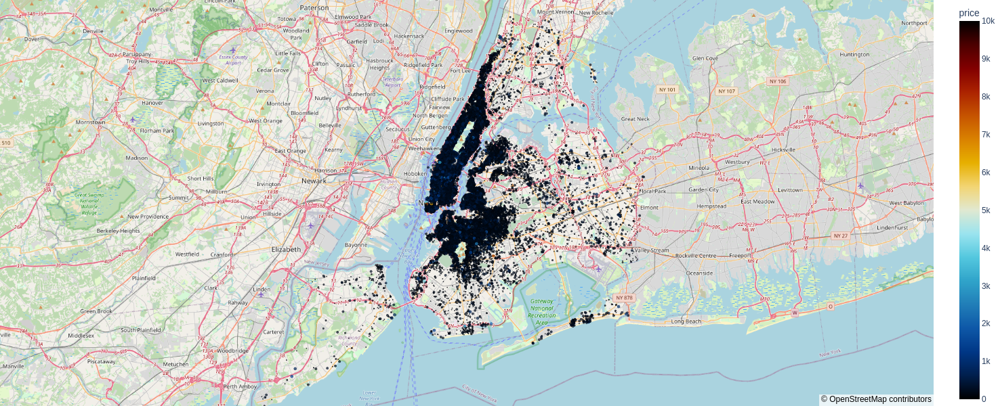

<h1>Real State Rent</h1>

This is a fictional project for studying purposes. The context, questions and people involved are fictional. The dataset used in this project is from Kaggle and it is available <a href="https://www.kaggle.com/datasets/dgomonov/new-york-city-airbnb-open-data" target="_blank">there</a>.

<h2>1. Description of the Business Problem</h2>

The CEO from a company would like to diversify his business and start investing in real estate. He defined that he would buy real estate in New York City, in the United States. As it is one of the most expensive places to live in the country, he believes that he will obtain a satisfactory return on his investments if he rents properties in the city. Since all of his decisions are based on data, he wants someone to help him in this endeavor.

He initially plans to lease the properties acquired and for that reason he defined that he will use the Airbnb platform for this purpose. He found a dataset on the internet containing data on the behavior of hosts and their properties in New York City.

He wants help to find out the regions with the highest rentals and highest prices and which apartments or houses are in favorable regions of New York City. He believes these characteristics will help him to recover the money invested in the acquisition of some properties more quickly. The challenge is to conduct an exploratory analysis and answer the questions posed by the CEO.

<h3>2. Dataset Attributes</h3>

Information about the atrributes can be found <a href="https://www.kaggle.com/harlfoxem/housesalesprediction/discussion/207885" target="_blank">here</a>.

<table style="width:100%">
<tr><th>Attribute</th><th>Description</th></tr>
<tr><td>id</td><td>Unique ID for each house/apt</td></tr>
<tr><td>host_id</td><td>ID of the host of the house/apt</td></tr>
<tr><td>host_name</td><td>Name of the host</td></tr>
<tr><td>neighbourhood_group</td><td>Name of the borough the property is located in</td></tr>
<tr><td>neighbourhood</td><td>Name of the neighbourhood the property is located in</td></tr>
<tr><td>latitude</td><td>Property latitude</td></tr>
<tr><td>longitude</td><td>Property longitude</td></tr>
<tr><td>room_type</td><td>Type of property being rented, may be the entire house/apt, a private room or a shared room</td></tr>
<tr><td>price</td><td>Price to pay for the rent</td></tr>
<tr><td>minimum_nights</td><td>Minimum quantity of nights someone can rent a property</td></tr>
<tr><td>number_of_reviews</td><td>Number of reviews that property received</td></tr>
<tr><td>last_review</td><td>The date that specific property was reviewed for the last time</td></tr>
<tr><td>reviews_per_month</td><td>Average number of times that property is reviewed per month</td></tr>
<tr><td>calculated_host_listings_count</td><td>Number of properties the host from a specific property is responsible for in the dataset</td></tr>
<tr><td>availability_365</td><td>Number of days in the next 365 days that property is available to be rent</td></tr>
</table>

<h4>New York City Boroughs</h4>

<h4>Properties Distribution in New York City</h4>

<h2>3. Business Premises</h2>

<h3>The premises that were assumed for the development of the business problem solution are:</h3>

<ul>
<li>Every property rented was reviewed once the contract has come to an end.</li>
<li>Every property has been avilable since the date of the last review.</li>
<li>Rows with NA values in the 'last_review' column represents properties that were never rented or reviewed.</li>
<li>The foundation of Airbnb were considered to fill the NA values in the 'last_review' column.</li>
</ul>

<h2>4. Solution Strategy</h2>

<ol>
<li>Download the dataset from <a href="https://www.kaggle.com/datasets/dgomonov/new-york-city-airbnb-open-data" target="_blank">Kaggle</a>.</li>
<li>Understand the business problem.</li>
<li>Clean, analyse and explore the dataset using data science packages in Python.</li>
<li>Propose a few insights about the dataset and test them.</li>
<li>Answer the questions from the CEO. The questions and answers can be found <a href="https://github.com/m4theus4ndr4de/insights-airbnb-nyc/blob/main/airbnb_nyc_insights.ipynb" target="_blank">here</a>.</li>
</ol>

<h2>5. The Insights</h2>

<b>I1:</b> Private rooms are more than 20% more expensive than shared rooms.

<b>True:</b> Private rooms are 28% more expensive than shared rooms.

<b>I2:</b> Most neighbourhoods among the 10 with the highest prices and with more than 20 houses/apts are in Manhattan.

<b>True:</b> The first one taht is not in Manhattan is in Brooklyn and it is the 15th.

<b>I3:</b>Properties that were never reviewed are 10% cheaper than those at least once reviewed.

<b>False:</b> The average price of the properties that were never reviewed are greater than the price of those properties that were reviewed at least once.

<h2>6. Conclusion</h2>

The questions from the CEO that motivated this project were answered. Some of the answers can lead to future profit. Based on data, the CEO can take further steps on the real state market.

<h2>7. Future Work</h2>

<ul>
<li>Create more insights.</li>
<li>Develop a machine learning model to predict the rest price of a property.</li>
<li>Develop a machine learning model to predict if a property with certain characteristics should be bought or not.</li>
</ul>
